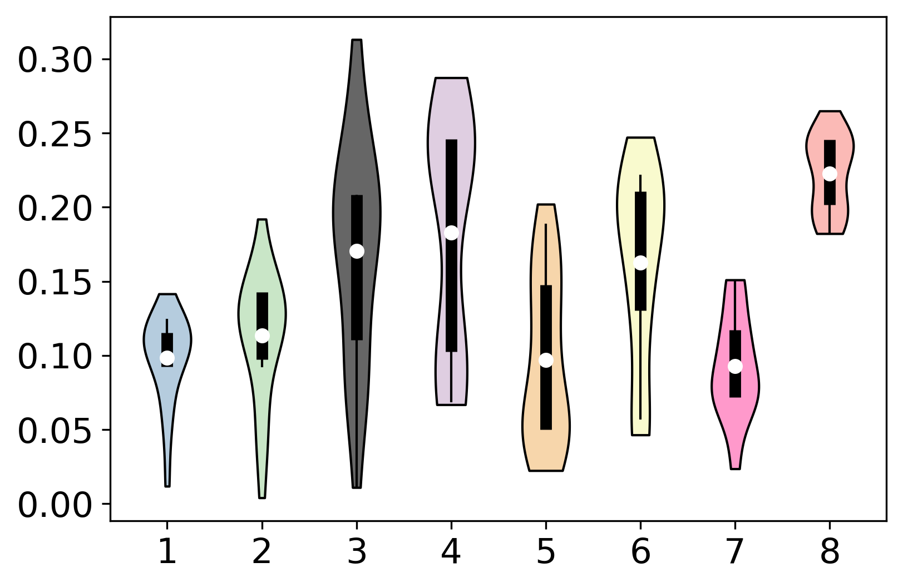
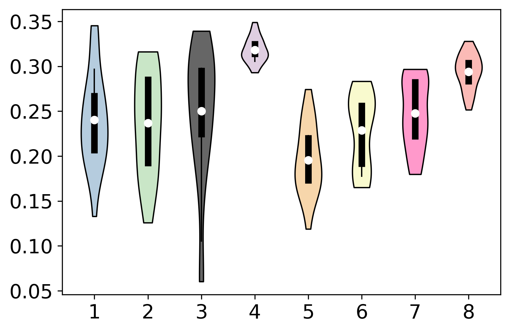

# Learning Disentangled Representation by Exploiting Pretrained Generative Models: A Contrastive Learning View

<a href="https://arxiv.org/abs/2102.10543"></a>
<a href="https://opensource.org/licenses/MIT"></a>

> **Learning Disentangled Representation by Exploiting Pretrained Generative Models: A Contrastive Learning View** <br>
> Xuanchi Ren*, Tao Yang*, Yuwang Wang and Wenjun Zeng <br>
> *ICLR 2022*<br>
> \* indicates equal contribution 

[[Paper](https://openreview.net/forum?id=j-63FSNcO5a)]
[[ArXiv](https://arxiv.org/abs/2102.10543)]
<!-- [[Appendix](https://xuanchiren.com/pub/DisCo_appendix.pdf)] -->

## Update:

:white_check_mark: Update StyleGAN2  
:white_check_mark: Update SNGAN  
:black_square_button: Update VAE  
:black_square_button: Update Glow  
:white_check_mark: Evaluation  

## Description   


In this repo, we propose an **unsupervised** and **model-agnostic** method: Disentanglement via Contrast (**DisCo**) in the Variation Space.
This code **discovers disentangled directions** in the latent space and **extract disentangled representations** from images with **Contrastive Learning**.
DisCo achieves the state-of-the-art disentanglement given pretrained non-disentangled generative models, **including GAN, VAE, and Flow**.  


**NOTE:** The following results are obtained in a completely *unsupervised* manner. More results (including VAE and Flow) are presented in [*Appendix*](https://xuanchiren.com/pub/DisCo_appendix.pdf).

## Disentangled Directions in the Latent Space
| FFHQ StyleGAN2 |  |
| :---: | :---: |
| Pose | Smile |
|  |  |
| Race | Oldness |
|  |  |
| Overexpose | Hair |
|  |  |

| Shapes3D StyleGAN2 |  |
| :---: | :---: |
| Wall Color | Floor Color |
|  |  |
| Object Color | Pose |
|  |  |

| Car3D StyleGAN2 | |
| :---: | :---: |
| Azimuth | Yaw |
|  |  |

| Anime SNGAN | |
| :---: | :---: |
| Pose | Natureness |
|  |  |
| Glass | Tone |
|  |  |

## Disentangled Representation

**NOTE:** DisCo achieves the state-of-the-art disentanglement

| Shapes3D | |
| :---: | :---: |
| MIG | DCI |
|  |  |

| Car3D | |
| :---: | :---: |
| MIG | DCI |
|  |  |

| MPI3D | |
| :---: | :---: |
| MIG | DCI |
|  |  |

## Getting Started
### Prerequisites
- NVIDIA GPU + CUDA CuDNN
- Python 3

### Installation
- Clone the repository:
``` 
git clone https://github.com/xrenaa/DisCo.git
cd DisCo
```
- Dependencies (To Do):  
We recommend running this repository using [Anaconda](https://docs.anaconda.com/anaconda/install/). 
<!-- All dependencies for defining the environment are provided in `disco.yaml`. 
 -->
 
- Docker:  
Alternatively, you can use `Docker` to run the code. We provide `thomasyt/gan-disc` for easy use.

### Pretrained Models
Please download the pre-trained models from the following links and put them to the corresponding paths. 
| Path | Description
| :--- | :----------
|[shapes3d_StyleGAN](https://drive.google.com/drive/folders/1yHQPydwY6hwmeRw4AeE-WWZIMBq9IpUn?usp=sharing) | StyleGAN2 model pretrained on `shapes3d`: range from `0-4.pt`. Corresponding path: `./pretrained_weights/shapes3d/`.
|[cars3d_StyleGAN](https://drive.google.com/drive/folders/102AUEgaedaUuf9JHpHbAWyIpC7koHZi8?usp=sharing) | StyleGAN2 model pretrained on `cars3d`: range from `0-4.pt`. Corresponding path: `./pretrained_weights/cars3d/`.
|[mpi3d_StyleGAN](https://drive.google.com/drive/folders/1w4NGGvrwwTBZEA4MvWmTn39srAxJv3On?usp=sharing) | StyleGAN2 model pretrained on `mpi3d`: range from `0-4.pt`. Corresponding path: `./pretrained_weights/mpi3d/`.
|[shapes3d_VAE](https://drive.google.com/drive/folders/1yHQPydwY6hwmeRw4AeE-WWZIMBq9IpUn?usp=sharing) | VAE model pretrained on `shapes3d`: range from `VAE_0-4`. Corresponding path: `./pretrained_weights/shapes3d/`.
|[cars3d_VAE](https://drive.google.com/drive/folders/102AUEgaedaUuf9JHpHbAWyIpC7koHZi8?usp=sharing) | VAE model pretrained on `cars3d`: range from `VAE_0-4`. Corresponding path: `./pretrained_weights/cars3d/`.
|[mpi3d_VAE](https://drive.google.com/drive/folders/1w4NGGvrwwTBZEA4MvWmTn39srAxJv3On?usp=sharing) | VAE model pretrained on `mpi3d`: range from `VAE_0-4`. Corresponding path: `./pretrained_weights/mpi3d/`.

For SNGAN, you can run the following code to download the weights for `MNIST` and `Anime`:
```
python ./pretrained_weights/download.py
```

## Training
To train the models, make sure you download the required models and put them to the correct path.

#### **Training on StyleGAN2**
```
python train.py \
--G stylegan \
--dataset 0 \
--exp_name your_name \
--B 32 \
--N 32 \
--K 64 
```
For `--dataset`, you can choose `0` for shapes3D, `1` for mpi3d, `2` for cars3d.

#### **Training on SNGAN**
```
python train.py \
--G sngan \
--dataset 5 \
--exp_name your_name \
--B 32 \
--N 32 \
--K 64 
```
For `--dataset`, you can choose `5` for MNIST, `6` for Anime.

## Evaluation

- Dependencies:  For evaluation, you will need `tensorflow`, `gin-config`.

- Download the dataset (except for Shapes3D):
``` 
cd data
./dlib_download_data.sh 
```
For Shapes3D, you will first need to download the data from [Google Cloud Storage](https://console.cloud.google.com/storage/browser/3d-shapes). Click on this link and left-click the file `3dshapes.h5` to download it. Then you should put it under directory `data`.

- Run the evaluation:
 ```
python evaluate.py --dataset 0 --exp_name your_name 
```
For `--dataset`, you can choose `0` for shapes3D, `1` for mpi3d, `2` for cars3d (you can only evaluate the performance on these datasets). The results will be put under the  same directory with the checkpoint.

## Credits

Navigator and SNGAN are based on: https://github.com/anvoynov/GANLatentDiscovery.

StyleGAN are based on: https://github.com/rosinality/stylegan2-pytorch.

Disentanglement metrics are based on: https://github.com/google-research/disentanglement_lib.


## BibTeX

```bibtex
@inproceedings{ren2022DisCo,
  title   = {Learning Disentangled Representation by Exploiting Pretrained Generative Models: A Contrastive Learning View},
  author  = {Ren, Xuanchi and Yang, Tao and Wang, Yuwang and Zeng, Wenjun},
  booktitle = {ICLR},
  year    = {2022}
}
```
